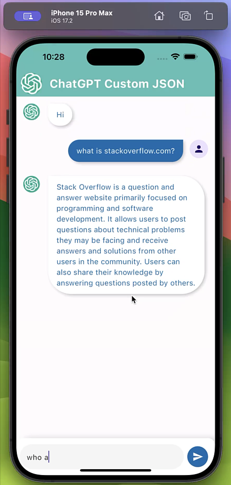

# chat_gpt_flutter_custom_json

### Output Gif

&nbsp;

### Flutter Packages Used

1. [http](https://pub.dev/packages/http) version:1.2.1 for post request.

### Example Request and Response in JSON

[https://platform.openai.com/docs/api-reference/chat/create](https://platform.openai.com/docs/api-reference/chat/create) 

