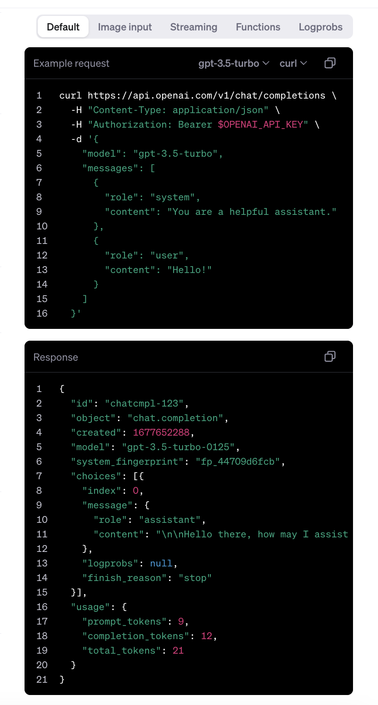

# chat_gpt_flutter_custom_json

### Output Gif

&nbsp;

### Flutter Packages Used

1. [http: ^1.2.1](https://pub.dev/packages/http) for post request

### Example Request and Response in JSON

[https://platform.openai.com/docs/api-reference/chat/create](https://platform.openai.com/docs/api-reference/chat/create) 

A new Flutter project.

## Getting Started

This project is a starting point for a Flutter application.

A few resources to get you started if this is your first Flutter project:

- [Lab: Write your first Flutter app](https://docs.flutter.dev/get-started/codelab)
- [Cookbook: Useful Flutter samples](https://docs.flutter.dev/cookbook)

For help getting started with Flutter development, view the
[online documentation](https://docs.flutter.dev/), which offers tutorials,
samples, guidance on mobile development, and a full API reference.
