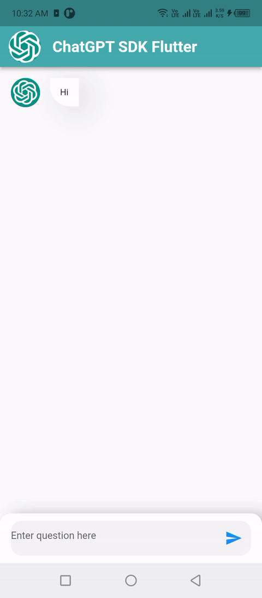
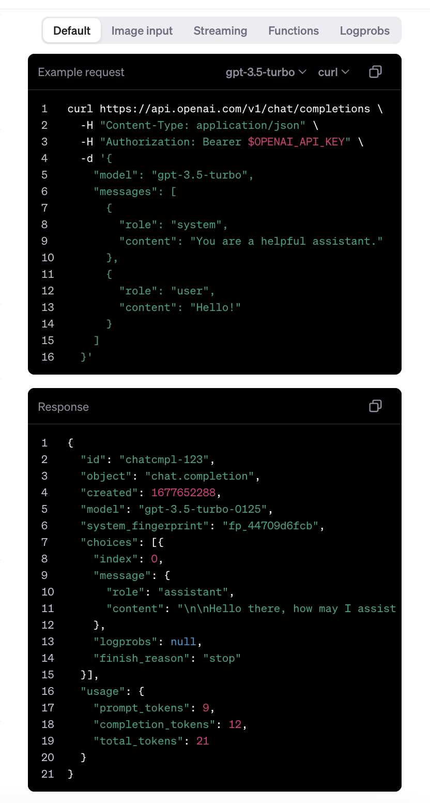

## 1. Research: Chat GPT App in Flutter

- Keywords:
    - chatgpt flutter
    - chatgpt sdk
    - flutter chatgpt sdk
    - chatgpt flutter app
    - flutter ai
    - flutter chat gpt github
    - chatbot gpt github
    - flutter chatbot github
    - build chatgpt app in flutter using openai api
    - openai_gpt3_api flutter
    - how to use chat gpt api in flutter
    - flutter ai package
    - flutter ai projects
    - chat gpt and flutter
    - how to use chat gpt api in flutter
    - chat gpt api key
    - chat gpt api documentation
- Video Title: Chat GPT App in Flutter with Custom JSON Response from OpenAI

## 2. Research: Competitors

**Flutter Videos/Articles**

- 56K: https://youtu.be/94JmNb1IhX0
- 6.1k: https://youtu.be/UaKFvEPjs9I
- 2.9K: https://youtu.be/qUEUMxGW_0Q
- https://pub.dev/packages/chat_gpt_sdk
- https://pub.dev/documentation/chat_gpt_sdk
- https://dev.to/riyaspullurofficial/chat-gpt-openai-using-flutter-48bh

**Android/Swift/React Videos**

- 1.8K: https://youtu.be/bLktoOzb4R0
- 1.2K: https://youtu.be/yw0c2IVfzYg
- 1.1K: https://youtu.be/Jl51WzDpnYE
- 1.1K: https://youtu.be/nmwJceyIRLk
- 30K: https://youtu.be/ahhze_u5ZUs
- 28K: https://www.youtube.com/watch?v=9DjbQpbQVFo
- 184: https://www.youtube.com/watch?v=EbfHc2vZKW4
- 1.5K: https://www.youtube.com/watch?v=uuuz9TrjVvA
- 5K: https://www.youtube.com/watch?v=0FDiaNcW5s4
- 4.6K: https://www.youtube.com/watch?v=tdxgG9Gq41A
- 64K: https://www.youtube.com/watch?v=kR9Kgo8H7po
- 18K: https://www.youtube.com/watch?v=XtnYX1m2Ha8
- https://www.codester.com/items/42353/chat-gpt-ai-chatbot-android-app-with-kotlin
- https://github.com/lambiengcode/compose-chatgpt-kotlin-android-chatbot
- https://www.geeksforgeeks.org/how-to-build-a-chatgpt-like-app-in-android-using-openai-api/
- https://iosexample.com/chat-gpt-open-ai-with-swift-for-ios/
- https://medium.com/codex/how-to-integrate-openais-gpt-3-in-swift-337973ce209c
- https://chatbotslife.com/how-to-add-chatbot-to-react-native-7176bc19a7f
- https://medium.com/@hrupesh/creating-a-chatbot-and-translation-app-with-nextjs-and-react-native-using-chatgpt-e4cc6c986106
- https://medium.com/@hello_chirag/creating-powerful-chatbots-a-developers-guide-to-integrating-chatgpt-and-react-native-dfa320e33917

**Great Features**

- This code gives the idea of manually getting JSON Response from OpenAI and using the models, type,
  and many other things with custom JSON like you can
  see [here](https://platform.openai.com/docs/api-reference/chat/create).

**Problems from Videos**

- Question: How will generate my own api token?

Answer: Find your OpenAI API key [here](https://platform.openai.com/account/api-keys).

**Problems from Flutter Stackoverflow**

- https://stackoverflow.com/questions/75524962/flutter-chatgpt-sdk-continue-discussion-with-context

## 3. Video Structure

**Main Points / Purpose Of Lesson**

1. In this video, you will learn how to use OpenAI ChatGPT as chat bot for users to question from
   chat bot.
2. Main points:
    - Get your api key from [here](https://platform.openai.com/account/api-keys).
    - See the example request and
      response [here](https://platform.openai.com/docs/api-reference/chat/create).
    - Make model of response and then send the request to OpenAI using `post` method of http.
3. This can also be used for SSE stream chat by some modifications in this project.

**The Structured Main Content**

1. Run `dart pub add http` in your terminal to add http in your project's pubspec.yaml file.
2. In `main.dart` file, there are some theming properties and `ChatBotPage` is being called
   through `home` property.
3. In `message_model.dart` file, there is simple model with isBot and message arguments:

    ```dart
    class MessageModel {
      final bool isBot;
      final String message;
    
      MessageModel(this.isBot, this.message);
    }
    ```

   **Chat Bot Gif:**

   

4. In `chat_bot_page.dart` file, I have defined some constants and variables:

    - `kDefault` constant is used for UI.
    - `messageController` is used to control the text field where question is written.
    - `formKey` is used to validate text field.
    - `apiKey` is OpenAI secret key from [here](https://platform.openai.com/api-keys).
    - `messages` is list of MessageModel.
    - `isAiTyping` is a boolean to show circular progress indicator when waiting for the answer from
      chat GPT.

```dart
static const kDefault = 15.0;
final messageController = TextEditingController();
final formKey = GlobalKey<FormState>();
final apiKey = ApiKey.apiKey;
final messages = [MessageModel(true, 'Hi')];
bool isAiTyping = false;
```

You can get the `ExampleRequest` and `Response` in JSON forms
from [here](https://platform.openai.com/docs/api-reference/chat/create).<br/>
<br/>
First create a model of JSON response from OpenAI named `ResponseModel`. <br/>
Code for sending message to OpenAI chat bot with custom JSON is here:

```dart
void sendMessage() async {
  messages.add(
    MessageModel(
        false, messageController.text),
  );
  setState(() => isAiTyping = true);
  final response = await http.post(
    Uri.parse('https://api.openai.com/v1/chat/completions'),
    headers: {
      'Content-Type': 'application/json',
      'Authorization': 'Bearer $apiKey'
    },
    body: jsonEncode({
      "model": "gpt-3.5-turbo",
      "messages": [
        {"role": "user", "content": messageController.text}
      ],
      "temperature": 1,
      "max_tokens": 64,
      "top_p": 1,
      "frequency_penalty": 0,
      "presence_penalty": 0
    }),
  );
  messageController.clear();
  debugPrint('response :$response');
  debugPrint('response.body :${response.body}');
  debugPrint('response.statusCode :${response.statusCode}');
  if (response.statusCode == 200) {
    setState(() {
      final responseModel = ResponseModel.fromJson(jsonDecode(response.body));
      messages.add(
        MessageModel(
          true,
          responseModel.choices[0].message!.content.toString(),
        ),
      );
      isAiTyping = false;
      for (MessageModel element in messages) {
        debugPrint(element.toString());
        debugPrint('element.message => ${element.message}');
      }
    });
  }
}
```

Following is the code for UI:<br/>

itemBuilder first confirms that if the message in the list of messages is from bot then show bot
card otherwise show the user card.

```dart
  @override
Widget build(BuildContext context) =>
    Scaffold(
      appBar: AppBar(
        leading: const Padding(
          padding: EdgeInsets.only(left: 10),
          child: CircleAvatar(
            backgroundImage: AssetImage('chatGptImage.PNG'),
          ),
        ),
        title: const Text('ChatGPT in Flutter'),
      ),
      body: Form(
        key: formKey,
        child: Column(
          children: [
            Flexible(
              child: ListView.builder(
                itemCount: messages.length,
                itemBuilder: (context, index) =>
                messages[index].isBot
                    ? botCard(index: index)
                    : userCard(index: index),
              ),
            ),
            Align(
              alignment: Alignment.bottomCenter,
              child: Container(
                width: double.maxFinite,
                padding: const EdgeInsets.symmetric(
                  horizontal: kDefault,
                  vertical: kDefault / 1.5,
                ),
                decoration: BoxDecoration(
                  color: Colors.white,
                  borderRadius: const BorderRadius.only(
                    topRight: Radius.circular(kDefault),
                    topLeft: Radius.circular(kDefault),
                  ),
                  boxShadow: [
                    BoxShadow(
                      color: Colors.black.withOpacity(.23),
                      offset: const Offset(kDefault / 1.2, .5),
                      blurRadius: kDefault,
                    ),
                  ],
                ),
                child: Container(
                  decoration: BoxDecoration(
                    color: Colors.grey.withOpacity(.12),
                    borderRadius: BorderRadius.circular(kDefault),
                  ),
                  child: TextFormField(
                    controller: messageController,
                    autofocus: true,
                    decoration: InputDecoration(
                      suffixIcon: isAiTyping
                          ? Transform.scale(
                        scale: 0.5,
                        child: const CircularProgressIndicator(
                          strokeWidth: 6,
                        ),
                      )
                          : GestureDetector(
                        onTap: () {
                          if (formKey.currentState!.validate()) {
                            sendMessage();
                          }
                        },
                        child: const Icon(
                          Icons.send,
                          size: kDefault * 1.6,
                          color: Colors.blue,
                        ),
                      ),
                      hintText: 'Enter question here',
                      border: InputBorder.none,
                    ),
                    textInputAction: TextInputAction.send,
                    validator: (value) =>
                    value!.isEmpty ? 'Enter some question' : null,
                  ),
                ),
              ),
            )
          ],
        ),
      ),
    );
```

`userCard()` and `botCard()` widgets are almost same:

```dart
  Padding userCard({required int index}) {
  return Padding(
    padding: const EdgeInsets.symmetric(
      horizontal: kDefault,
      vertical: kDefault,
    ),
    child: Stack(
      children: [
        const Align(
          alignment: Alignment.centerRight,
          child: CircleAvatar(
            child: Icon(Icons.person),
          ),
        ),
        Align(
          alignment: Alignment.centerRight,
          child: Container(
            margin: const EdgeInsets.only(
                left: kDefault / 2, right: kDefault * 3.6),
            padding: const EdgeInsets.symmetric(
              horizontal: kDefault / 1.1,
              vertical: kDefault / 1.2,
            ),
            decoration: BoxDecoration(
              color: Colors.white,
              borderRadius: const BorderRadius.only(
                bottomRight: Radius.circular(kDefault * 1.8),
              ),
              boxShadow: [
                BoxShadow(
                  color: Colors.grey.withOpacity(.12),
                  offset: const Offset(.5, kDefault / 1.6),
                  blurRadius: kDefault * 2,
                ),
              ],
            ),
            child: Text(
              messages[index].message.trim(),
              maxLines: 4,
            ),
          ),
        ),
      ],
    ),
  );
}

Padding botCard({required int index}) =>
    Padding(
      padding: const EdgeInsets.symmetric(
        horizontal: kDefault,
        vertical: kDefault,
      ),
      child: Stack(
        children: [
          const Align(
            alignment: Alignment.centerLeft,
            child: CircleAvatar(
              backgroundImage: AssetImage('chatGptImage.PNG'),
              radius: 18,
            ),
          ),
          Align(
            alignment: Alignment.centerLeft,
            child: Container(
              margin: const EdgeInsets.only(
                  right: kDefault / 2, left: kDefault * 3.6),
              padding: const EdgeInsets.symmetric(
                horizontal: kDefault / 1.1,
                vertical: kDefault / 1.2,
              ),
              decoration: BoxDecoration(
                color: Colors.white,
                borderRadius: const BorderRadius.only(
                  bottomLeft: Radius.circular(kDefault * 1.8),
                ),
                boxShadow: [
                  BoxShadow(
                    color: Colors.black.withOpacity(.12),
                    offset: const Offset(kDefault / 1.2, kDefault / 2),
                    blurRadius: kDefault * 2,
                  ),
                ],
              ),
              child: Text(
                messages[index].message.trim(),
                maxLines: 100,
              ),
            ),
          ),
        ],
      ),
    );
```